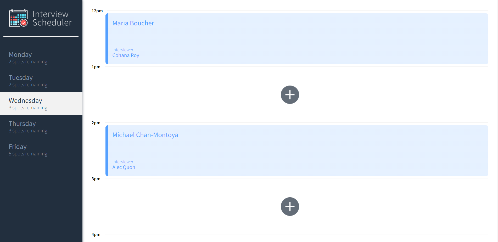
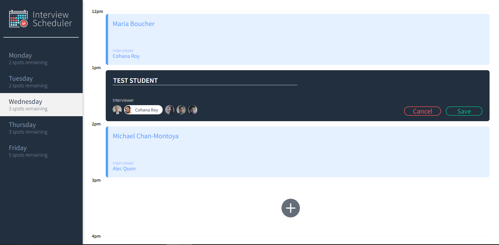
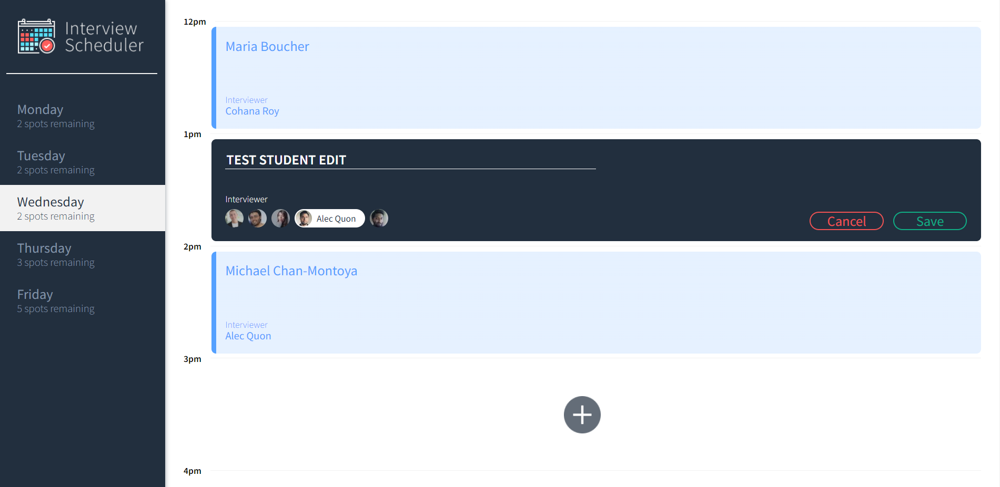
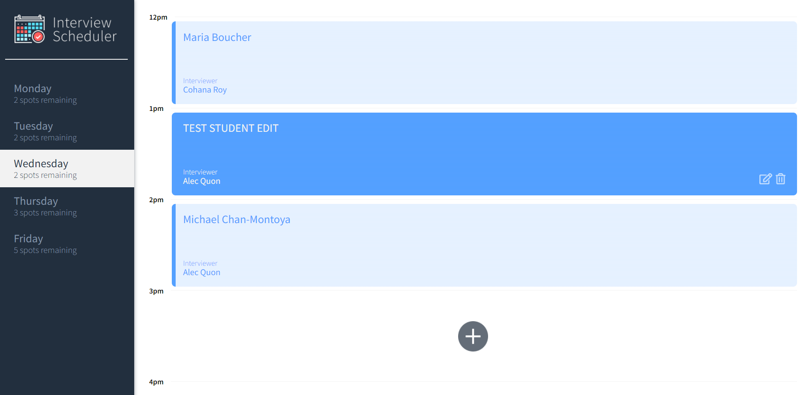
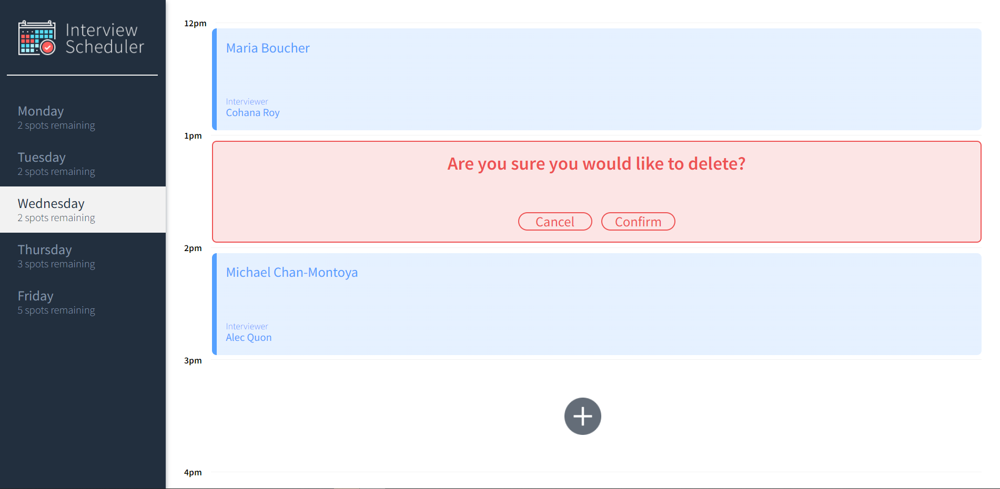

# Interview Scheduler
Interview Scheduler app is an app that features booking, editting or cancelling interviews with interviewers for users. The app lets users to choose their desired timeslots with desired interviewers from Monday to Friday, between 12pm to 5pm. The Interview Scheduler app is consisted with a single page, and it is built with REACT. Also, its database is fetched/stored by API.     

## Setup

Install dependencies with `npm install`.

## Running Webpack Development Server

```sh
npm start
```

## Running Jest Test Framework

```sh
npm test
```

## Running Storybook Visual Testbed

```sh
npm run storybook
```

## Final Product

#### Main Page 


#### Creating appointment 


#### Editing appointment 




#### Deleting appointment 



## Dependencies

- axios
- classnames
- normalize.css
- react
- react-dom
- react-scripts
- Babel/core
- Storybook/addon-actions
- Storybook/addon-backgrounds
- Storybook/addon-links
- Storybook/addons
- Storybook/react
- Testing-library/jest-dom
- Testing-library/react
- Testing-library/react-hooks
- Babel-loader
- Node-sass
- Prop-types
- React-test-renderer
- cypress
